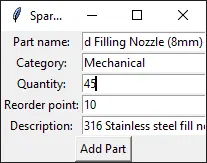

# SparesRoom

A spares inventory tracker built in Python and SQLite, with both a CLI and a desktop GUI.



## Why I built this

During an engineering internship, I built a VBA/Excel tool to manage spares inventory on a manufacturing shop floor. Having worked extensively on finishing lines, I saw firsthand the need to track hundreds of parts across categories like Mechanical, Electrical, Pneumatics, Tooling, and Fasteners in an environment that previously had no digital system.

Started in August 2026, this project is an independent rebuild of that idea from scratch in Python, built to be a cleaner and more portable version of the original concept.

## Features

* Add new parts with a category, quantity, reorder point, and description.
* Adjust stock levels (increase or decrease) by part ID.
* Store data locally using SQLite with no server setup required.
* Access the tracker through a command-line interface or a Tkinter desktop GUI.
* Catch invalid entries using input validation with clear error messages.
* Verify logic with `pytest`, which includes failure-path coverage for actions like adjusting a nonexistent part.

## Tech Stack

* Python
* SQLite (`sqlite3`)
* Tkinter
* `pytest`

## Project Structure

```text
sparesroom/
├── database.py       # connection + schema setup
├── inventory.py      # core logic: add_part, adjust_quantity
├── cli.py            # command-line interface
├── gui.py            # Tkinter desktop interface
├── tests/
│   └── test_inventory.py
└── requirements.txt

```

## Getting Started

Clone the repository:

```bash
git clone https://github.com/RogueCode21/sparesroom 
cd sparesroom

```

Install dependencies:

```bash
pip install -r requirements.txt

```

Run the CLI:

```bash
python cli.py

```

Run the GUI:

```bash
python gui.py

```

Run the tests:

```bash
python -m pytest tests/ -v

```

## Design Notes

* Both `database.py` and `inventory.py` contain all the data logic. Because `cli.py` and `gui.py` are thin front ends that just call these functions, you can add new interfaces (like a web version) without touching the underlying logic.
* All SQL queries use parameterized placeholders (`?`) instead of string formatting to avoid SQL injection.
* The database file is excluded from version control. By checking the `.gitignore` rules, you will see that cloning the repository starts you with a fresh, empty database.